# 13. Examples

The `examples/` directory ships ten runnable Python demos that exercise
every major feature of SATOR: single- and multi-objective optimization,
soft goal types (`min`, `max`, `target`, `within_range`,
`minimize_below`, `maximize_above`), **hard-enforce goal types**
(`enforce_above`, `enforce_below`, `enforce_within_range` — see
§6.1.11), sum and ratio constraints, PCA dimensionality reduction,
SLSQP reconstruction, and GP surface maps.

Two of them — **demo 09** (pharmaceutical tablet, PCA path) and
**demo 10** (cosmetic O/W emulsion, non-PCA path) — are
**audit-style** scripts: their stdout and saved artifacts are designed
to be verified by a human reading this page. Real rendered figures
from their latest run are embedded below so you can see what a clean,
successful run looks like before you even install the repo.

Every figure on this page was generated by running the corresponding
script against a local server (see
[`examples/how_to_run_examples.md`](../examples/how_to_run_examples.md)
for the five-minute setup).

---

## 13.1 Demo index

| # | File | What it demonstrates | Acquisition |
|---|---|---|---|
| 01 | [`demo_01_rosenbrock_single_min.py`](../examples/demo_01_rosenbrock_single_min.py) | Single-objective `min` on the Rosenbrock banana. | `qei` |
| 02 | [`demo_02_ackley_target.py`](../examples/demo_02_ackley_target.py) | `target` goal — drive f to a chosen level set. | `qei` (advanced) |
| 03 | [`demo_03_himmelblau_within_range.py`](../examples/demo_03_himmelblau_within_range.py) | `within_range` goal on a four-minimum surface. | `qei` (advanced) |
| 04 | [`demo_04_zdt1_pareto.py`](../examples/demo_04_zdt1_pareto.py) | Multi-objective Pareto front vs. analytic ZDT1. | `qnehvi` |
| 05 | [`demo_05_mixture_sum_constraint.py`](../examples/demo_05_mixture_sum_constraint.py) | 3-ingredient mixture, sum-to-one constraint. | `qei` |
| 06 | [`demo_06_ratio_constraints.py`](../examples/demo_06_ratio_constraints.py) | Ratio constraint `0.5 ≤ A/B ≤ 2.0`. | `qei` |
| 07 | [`demo_07_paint_formulation.py`](../examples/demo_07_paint_formulation.py) | Paint blend — `min` + `max` + `within_range` + sum-to-one. | `qei` (advanced) |
| 08 | [`demo_08_ev_electrolyte_target.py`](../examples/demo_08_ev_electrolyte_target.py) | EV electrolyte — `target` + `within_range` + **`enforce_above`** safety floor + sum-to-one. PCA pipeline. | `qnehvi` (PCA, advanced) |
| 09 | [`demo_09_pharma_tablet_pca.py`](../examples/demo_09_pharma_tablet_pca.py) | **PCA flagship.** 7 excipients + 2 process params, 4 mixed goals, sum + ratio, `ScaledPCA(2)` + GP surfaces + SLSQP reconstruction. | `qei` (PCA) |
| 10 | [`demo_10_cosmetic_emulsion.py`](../examples/demo_10_cosmetic_emulsion.py) | **Non-PCA flagship.** 10 ingredients + 2 process params, 4 mixed goals, sum + ratio. | `qei` (advanced) |

Demos 09 and 10 are the recommended reference examples for new users
because they print a self-verifying audit trail and exercise the most
important engine features (PCA round-trip, reconstruction, multi-
objective Bayesian optimization, mixed goal types, sum/bound/ratio
constraints).

---

## 13.2 Demo 01 — Rosenbrock (single-objective `min`)

**Goal:** Minimise the classic Rosenbrock banana
`f(x₁, x₂) = (1 − x₁)² + 100·(x₂ − x₁²)²`
on `[−2, 2] × [−1, 3]`. Global minimum at `(1, 1)` where `f = 0`.

**Engine config.** One objective, goal `min`, `acquisition="qei"`,
batch size 4, 60 Dirichlet-sampled training points. This is the
simplest possible path through the engine: BoTorch
`qLogExpectedImprovement` with no constraints.

**What to look for.** Predicted stars clustered near the green `(1, 1)`
marker in the banana valley. The surface is plotted on
`log(1 + f)` because the banana is very steep — predictions along the
curved bottom of the banana are all near-optimal.

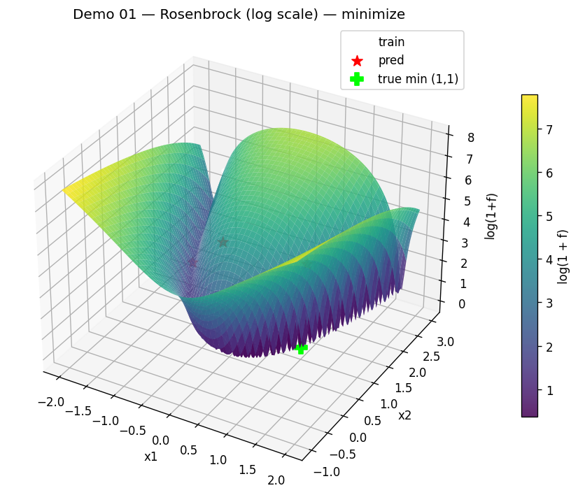

---

## 13.3 Demo 02 — Ackley (`target` goal)

**Goal:** Steer `f(x)` on the 2-D Ackley surface toward a chosen
level-set value `T = 2.5` rather than the global minimum. The
acquisition scorer penalises `|mu − T|` and adds a small
variance bonus.

**Engine config.** Goal `target` with `target_value=2.5`,
`target_tolerance=0.05`, `target_variance_penalty=0.25`. Because the
goal is not a simple `min` / `max`, the engine takes the
sampling + scoring advanced path (see
[§7.5 Acquisition](07-optimization-pipeline.md)).

**What to look for.** Predicted X markers land on the `f ≈ 2.5`
contour — a ring near the middle of the funnel, neither at the bottom
(f ≈ 0) nor at the rim (f ≈ 12).

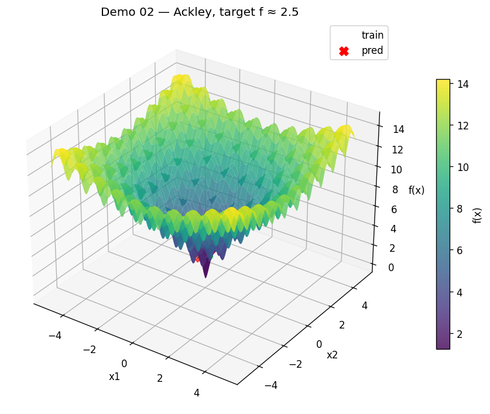

---

## 13.4 Demo 03 — Himmelblau (`within_range`)

**Goal:** Pick points with `f ∈ [10, 25]` (ideal 17.5) on the
Himmelblau function, which has four symmetric minima at `f = 0`. The
`within_range` goal maps to a quadratic band penalty plus an ideal-
value pull.

**Engine config.** Single objective, goal `within_range` with
`ideal_weight=0.5`. Advanced-goal Sobol-scoring path.

**What to look for.** Predictions in the *annular* region around each
of the four minima — inside the band, not at the bottoms of the bowls
(too low) and not on the ridges (too high).

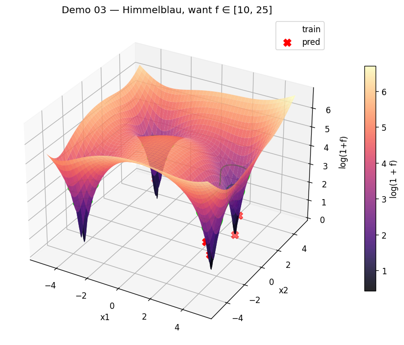

---

## 13.5 Demo 04 — ZDT1 multi-objective Pareto

**Goal:** 4-dim ZDT1 benchmark. Both `f1` and `f2` minimised. Analytic
Pareto front: `f2 = 1 − √f1` on `f1 ∈ [0, 1]`.

**Engine config.** Two objectives, both `min`, `acquisition="qnehvi"`
(which maps to `qLogExpectedHypervolumeImprovement` in SATOR's
multi-objective dispatcher), batch size 4, 96 training points. BoTorch
log-EHVI path — no constraints.

**What to look for.** Red X markers on or just above the green
analytic front. Training points (circles) are scattered far from the
front; most predictions sit exactly on it — a direct demonstration of
hypervolume-driven Pareto sampling.

Note that one or two batch members may land *off* the front in
high-uncertainty corners. That is honest BO exploration: qLogEHVI
rationally hedges against the GP's residual posterior uncertainty in
unexplored regions. In a real R&D loop the off-front members are
evaluated, added to the dataset, and the next batch tightens. For a
single-shot demo this is the expected behavior — not a bug.

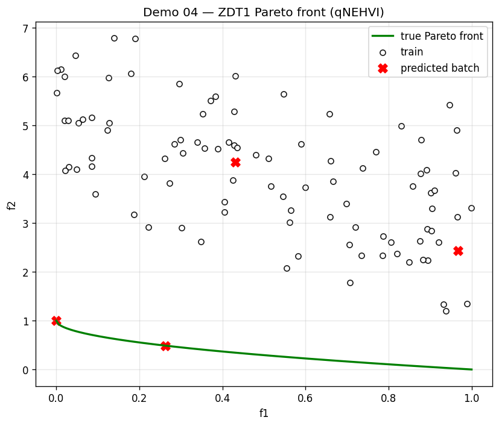

---

## 13.6 Demo 05 — 3-ingredient mixture (sum-to-one)

**Goal:** Minimise
`cost(w) = 2·w₁ + 0.5·w₂ + 3·w₃ + 4·(w₂ − 0.4)²` subject to
`w₁ + w₂ + w₃ = 1`, each `wᵢ ∈ [0, 1]`. The cheap minimum lies near
`w = (0.6, 0.4, 0)`.

**Engine config.**
`sum_constraints=[{"indices": [0,1,2], "target_sum": 1.0}]`. Single
objective, goal `min`, `qei`. The BoTorch optimiser receives the
sum-to-one as two linear inequalities (see
[§7.4](07-optimization-pipeline.md) and
`build_linear_constraints` in `optimizer/utils.py`).

**What to look for.** Red X markers inside the low-cost corner of the
simplex (bottom-right region, dark-purple on the color bar), on or
very close to the `w₁ + w₂ = 1` edge (where `w₃ = 0`). The script also
prints the per-prediction `w₁ + w₂ + w₃` so you can confirm the sum is
exactly 1.

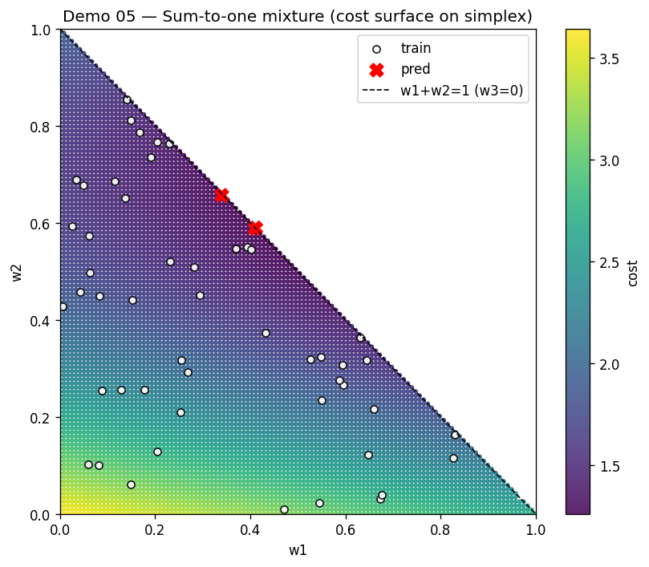

---

## 13.7 Demo 06 — Ratio constraint

**Goal:** Minimise `f(A, B) = (A − 4)² + (B − 3)²` with
`A, B ∈ [0.1, 10]` and `A / B ∈ [0.5, 2.0]`. The true minimum `(4, 3)`
has ratio `4/3 ≈ 1.33`, inside the allowed band.

**Engine config.**
`ratio_constraints=[{"i": 0, "j": 1, "min_ratio": 0.5, "max_ratio": 2.0}]`.
`qei` acquisition. Ratio constraints are translated into linear
inequalities
(`A − 0.5·B ≥ 0` and `2·B − A ≥ 0`) and passed to BoTorch
`optimize_acqf`.

**What to look for.** Every predicted X lies inside the white wedge
between the two ratio lines `A = 0.5·B` (dashed) and `A = 2·B`
(solid). The script also prints the per-prediction `A/B` ratio so you
can see every value is inside `[0.5, 2.0]`. Example output from a
recent run: `A/B per prediction: [0.616, 1.581, 1.351, 0.864]`.

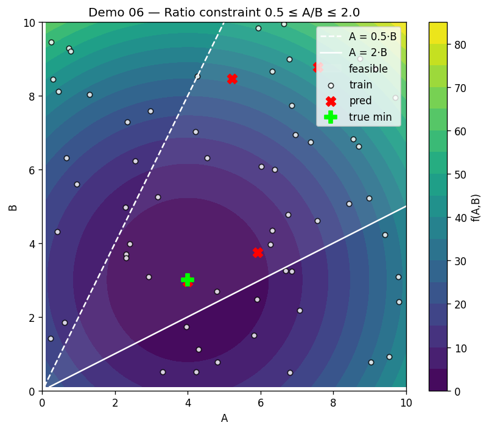

---

## 13.8 Demo 07 — Paint formulation (realistic mixed-goal mixture)

**Goal:** 6 ingredients (`pigment`, `binder`, `solvent`, `extender`,
`rheology_mod`, `defoamer`) summing to 1, plus two process parameters
(`temp_C`, `shear_rpm`). Three objectives:

- `cost` — **minimize** (dollar-weighted sum of prices)
- `opacity` — **maximize**
- `drying_time` — **within_range** `[25, 45]`, ideal `35`

**Engine config.** `sum_constraints` = mass fractions sum to 1.
Because one objective is `within_range`, the engine takes the
multi-objective advanced scoring path.

**What to look for.** The 2×2 figure is the recommended diagnostic
layout for real mixtures:

- **(a)** Objective-space scatter `cost` vs `opacity`, coloured by
  `drying_time`. Red X's should land in the low-cost / high-opacity
  corner while their colour matches the target band.
- **(b)** Histogram of training `drying_time` with the green
  acceptance band `[25, 45]` and the per-prediction values as red
  lines. Predictions sitting on the low side of the band is expected
  — the multi-objective optimizer trades drying_time against cost
  and opacity.
- **(c)** Stacked composition bars for the top-5 predictions — you
  can read the actual recipe per candidate.
- **(d)** Sum-to-one sanity check: all bars at exactly 1.0.

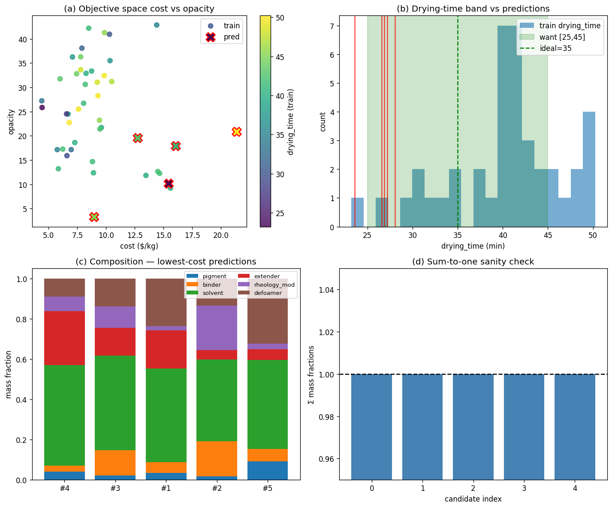

---

## 13.9 Demo 08 — EV electrolyte (hard stability floor + PCA)

**Goal:** 5 solvent/salt mass fractions (`EC`, `DMC`, `EMC`, `LiPF6`,
`additive`) plus `temp_C`. Three heterogeneous objectives that mix
**soft preferences** with a **hard safety floor**:

- `conductivity` — **soft** `target` `T = 10.5 mS/cm`
  (`target_tolerance = 0.5`)
- `viscosity` — **soft** `within_range` `[2.0, 5.0] cP`, ideal `3.0`
- `stability` — **hard** `enforce_above` floor `4.2 V` (safety
  requirement — a soft `maximize_above` is not acceptable here)

**Engine config.** PCA pipeline (`use_pca: true`, `pca_dimension: 3`)
— SATOR's preferred surrogate setup even for low-dim recipes because
it gives a small, dense latent GP and a single SLSQP reconstruction
back to named ingredients that provably satisfies the sum constraint.
Acquisition runs through the advanced Sobol-scoring path (any non
`min`/`max` goal triggers it); the `enforce_above` goal adds a hard
feasibility mask on the Sobol grid against the GP posterior mean.
See §6.1.11 for the full contract and the optional
`enforcement_uncertainty_margin` knob (LCB/UCB-based enforcement).

**What to look for.** The 2×2 figure:

- **(a)** `conductivity` histogram with the narrow green target band
  `10.5 ± 0.5`. Predictions (red lines) land well *above* the target
  band — a direct visual proof that the hard stability floor
  dominates the soft conductivity target. This is the intended
  behavior of the `enforce_*` family: soft goals can be sacrificed to
  keep hard constraints feasible.
- **(b)** `viscosity` histogram with the green band `[2.0, 5.0]`.
  Predictions land inside the band, near the ideal `3.0` — the soft
  `within_range` goal is respected because it does not conflict with
  the floor.
- **(c)** `stability` histogram with the floor at 4.2 V. The title
  reports `5/5 feasible`. Every prediction sits just above the floor
  — the `enforce_above` mask filtered the Sobol grid against the GP
  posterior, and the orchestrator tagged each prediction with
  `enforced_goals_satisfied=true`. The response's
  `diagnostics.enforcement` block carries the same information at a
  batch level.
- **(d)** Stacked composition bars with `✓` per candidate. All five
  recipes cluster around `EC ≈ 0.25`, since the forward stability
  model rewards EC-rich blends. The soft goals *shaped* the selected
  recipes within this EC-rich subspace.

Every returned prediction in the JSON carries
`enforced_goals_satisfied` and `enforced_violations`, so downstream
tools can filter the batch deterministically:

```json
"predictions": [
  {
    "candidate": { "EC": 0.25, "DMC": 0.10, ... },
    "objectives": [17.48, 3.56, 4.241],
    "enforced_goals_satisfied": true,
    "enforced_violations": []
  }
]
```

and the top-level diagnostics summarise the batch:

```json
"diagnostics": {
  "enforcement": {
    "enabled": true,
    "uncertainty_margin": 0.0,
    "n_total": 5,
    "n_satisfied": 5,
    "all_infeasible": false,
    "per_objective_violations": { "stability": 0 },
    "goals": [
      { "objective": "stability", "kind": "above", "lo": 4.2, "hi": null }
    ]
  }
}
```

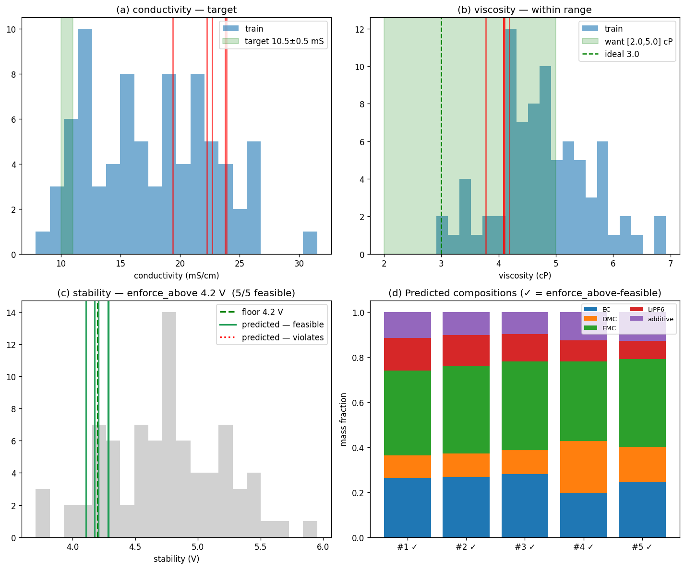

---

## 13.10 Demo 09 — Pharmaceutical tablet (PCA flagship)

### 13.10.1 What it does

A pharmaceutical immediate-release (IR) tablet is formulated from 7
excipients (`API`, `lactose`, `MCC`, `croscarmellose`, `PVP_K30`,
`Mg_stearate`, `silica`) with two process parameters (compaction
force in kN, blend time in minutes). Four mixed-goal objectives:

- `dissolution_30min` — **maximize** (higher is better)
- `hardness_N`        — **within_range** `[80, 150]`, ideal `115`
- `friability_pct`    — **minimize_below** threshold `1.0`
- `disintegration_s`  — **minimize_below** threshold `900`

Hard constraints under test:

- `sum(mass fractions) = 1.0`
- per-parameter bounds (7 ingredient + 2 process variables)
- `MCC / lactose` in `[0.55, 0.80]`  (ratio regression check)

The training set deliberately **violates** the tight `MCC/lactose`
window on several rows so the audit can demonstrate the engine
enforcing the ratio during SLSQP reconstruction.

### 13.10.2 Pipeline

1. Fit a `ScaledPCA(2)` (`StandardScaler` followed by `sklearn.PCA`)
   on the training inputs. See [§7 Optimization pipeline](07-optimization-pipeline.md)
   and [§9 Reconstruction](09-reconstruction.md) for the full story.
2. Fit a `SingleTaskGP` per objective in normalized PCA coordinates
   (with a `Normalize` input transform — the GP kernel sees unit-scale inputs).
3. Run the acquisition (`qei` with ParEGO scalarization) in PCA space.
   Candidates are restricted to the `[0, 1]²` trained PC envelope so
   predictions always land on the rendered GP surface.
4. Inverse-transform candidates back through `ScaledPCA`.
5. Repair the result with the SLSQP reconstructor so sum-to-one,
   bounds, and the `MCC/lactose` ratio all hold.

### 13.10.3 8-stage audit output

The script prints — and also saves to
`examples/responses/demo_09/NN_*.txt` — the following stages:

1. Training ingredient, parameter, and objective tables
2. Objectives spec + hard-constraint spec + engine config
3. PCA explained variance, loadings (on scaled features), training
   projections (raw and normalized)
4. Per-objective GP surface on the PCA(2) plane (mean + std)
5. Predicted candidates in PCA space
6. Reconstructed candidates in the original ingredient + process space
7. Metrics: reconstruction RMSE per feature, GP calibration
   (MAE / RMSE / mean `|z|`), best-train vs best-pred
8. Visual extras: objective histograms and a best-recipe bar chart

### 13.10.4 Figure 1 — PCA(2) GP surfaces (mean on top, std on bottom)

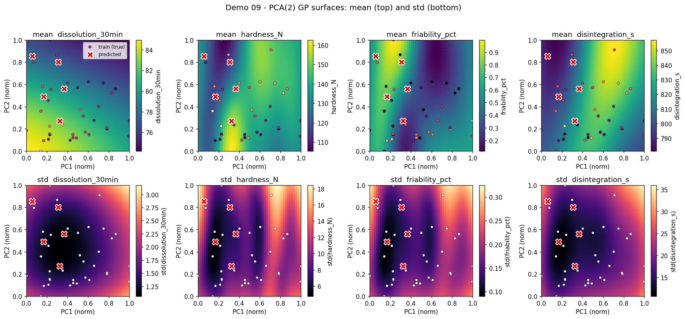

The top row shows the GP posterior **mean** per objective on the
PCA(2) plane. The dots are training formulations (encoded into PCA
space) and the red crosses are the predicted candidates. Because each
objective has its own GP, the same PCA coordinates map to different
heights on different surfaces — that is the multi-objective trade-off
made visible.

The bottom row shows the GP **standard deviation**. Dark regions are
well-explored (low uncertainty); bright regions are where the GP
extrapolates. A healthy run has predictions in the well-explored
central band; if a red cross lands on a bright-std region, that
candidate is more speculative and worth double-checking against the
forward model (Stage 7 calibration does exactly this).

### 13.10.5 Figure 2 — Objective distributions + best recipe

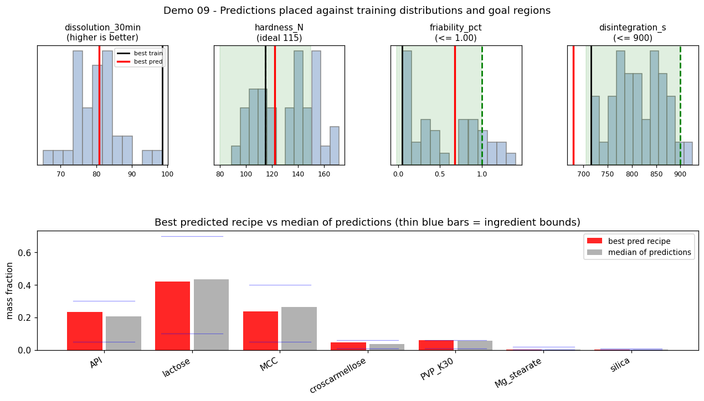

Top: one histogram per objective showing the training distribution,
the goal band or threshold (green shading), the best training value
(black line) and the best predicted value (red line). These four
subplots let you check at a glance whether the optimizer is pushing
*toward* the target for each objective.

Bottom: the best-predicted recipe in red against the median of all
predictions in grey, with thin blue bars marking each ingredient's
declared bounds. This is the concrete answer to "what should we
mix?".

### 13.10.6 Expected verdict

At the bottom of the audit stdout you should see:

```
  All hard-constraint checks PASSED on the 5/5 feasible predictions (sum, bounds, ratio).
```

Soft-goal compliance (how many predictions fall inside the `hardness`
band, below the `friability` threshold, etc.) is reported as an
informational metric — it is **not** a hard constraint and the
optimizer is free to trade one against another.

### 13.10.7 Files saved

- `examples/responses/demo_09_pharma_tablet_request.json`
- `examples/responses/demo_09_pharma_tablet_result.json`
- `examples/responses/demo_09/NN_*.txt` (stage-by-stage tables)
- `examples/responses/demo_09_pharma_tablet_pca_fig_*.png`

---

## 13.11 Demo 10 — Cosmetic O/W emulsion (non-PCA flagship)

### 13.11.1 What it does

A cosmetic oil-in-water face cream is formulated from 10 ingredients
(`water`, `glycerin`, `propanediol`, `squalane`, `jojoba_oil`,
`cetearyl_alcohol`, `PEG100_stearate`, `niacinamide`,
`hyaluronic_acid`, `preservative`) plus two process parameters
(`mix_temp_C`, `homog_speed_rpm`). Four mixed-goal objectives:

- `viscosity_cP`    — **within_range** `[15000, 30000]`, ideal `22500`
- `spreadability`   — **maximize**
- `stability_days`  — **maximize**
- `cost_per_kg`     — **minimize**

Hard constraints under test:

- `sum(mass fractions) = 1.0`
- per-parameter bounds (10 ingredient + 2 process variables)
- `cetearyl_alcohol / PEG100_stearate` in `[1.5, 3.0]`

Unlike demo 09 this demo runs **without PCA**: the GP is built
directly in the 12-dimensional ingredient + process space, so the
acquisition, the feasibility filter, and the ratio-enforcement logic
are all tested on the native input space.

### 13.11.2 Pipeline

1. Fit `SingleTaskGP` per objective directly on the 12-D training
   inputs (min/max `Normalize` input transform, `Standardize` outcome
   transform).
2. Because at least one objective is `within_range`, the acquisition
   takes the Sobol-plus-scoring branch — see
   [§7.5 Acquisition](07-optimization-pipeline.md) for details.
3. Project the Sobol grid onto sum-to-one, filter by the feasibility
   mask (sum, bounds, ratio), and rank by score.
4. On the top-k selection apply `sum → ratio-repair → sum` so every
   returned candidate strictly satisfies every hard constraint.

### 13.11.3 7-stage audit output

1. Training ingredient, parameter, and objective tables
2. Objectives spec + hard-constraint spec + engine config
3. Predicted candidate recipes (named ingredient + process columns)
4. GP posterior mean and std per objective at each candidate
5. Hard-constraint checks: sum, bounds, ratio (`[PASS]` lines)
6. GP calibration: MAE / RMSE / mean `|z|` vs a known forward model,
   plus soft-goal compliance and best-train vs best-pred
7. Visual summary

### 13.11.4 Figure 1 — Objectives + phase composition

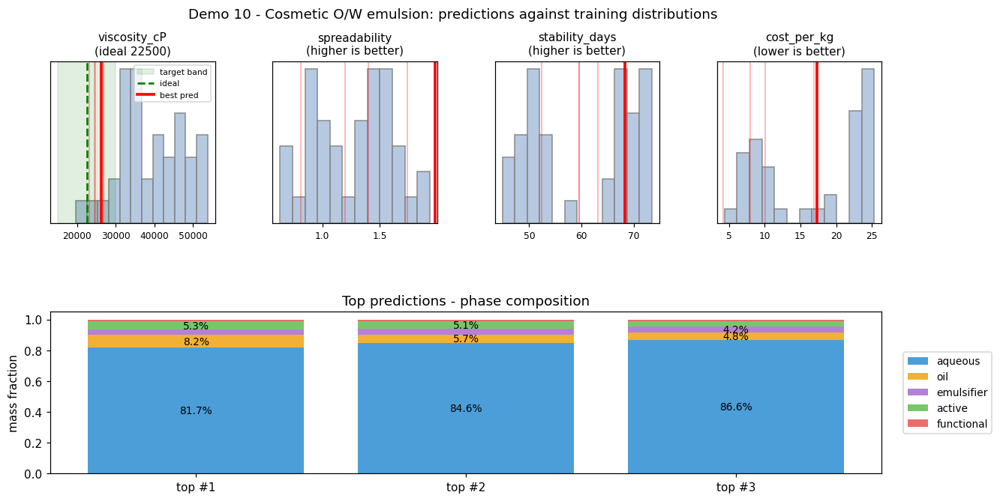

Top row: one histogram per objective showing the training
distribution, the target band (green for `within_range`, thin red
lines for `max`/`min`) and the best predicted value (red line).

Bottom: the top-3 predicted recipes rolled up into **phase groups**
(`aqueous`, `oil`, `emulsifier`, `active`, `functional`) so you can
see at a glance what kind of emulsion was proposed.

### 13.11.5 Expected verdict

```
  All hard-constraint checks PASSED on 5 predictions
  (sum, bounds, ratio). Non-PCA path is correct.
```

Typical GP-calibration numbers on this demo (with the min/max input
transform enabled): `viscosity_cP` RMSE ≈ 250 on a ~50 000 range,
`mean |z| < 1` across all four objectives — a good sanity check that
the GP is neither collapsed nor wildly overconfident.

### 13.11.6 Files saved

- `examples/responses/demo_10_cosmetic_emulsion_request.json`
- `examples/responses/demo_10_cosmetic_emulsion_result.json`
- `examples/responses/demo_10/NN_*.txt` (stage-by-stage tables)
- `examples/responses/demo_10_cosmetic_emulsion_fig_1_1.png`

---

## 13.12 Notes on interpretation

- GP surfaces are models learned from your data; they are not ground
  truth. Peaks and valleys indicate the model's belief about where
  the objective is high or low.
- In multi-objective mode the same encoded candidate is shown on all
  objective surfaces. Its z-value differs per surface because each
  objective has its own GP.
- Reconstruction (demo 09) ensures suggested formulations are valid
  in the original space — ingredients sum exactly to one and any
  declared ratio windows hold.
- "Soft-goal compliance" in demos 07, 08, 09, and 10 is **not** a
  correctness signal: a candidate that lands outside a
  `within_range` band is a trade-off, not a bug. The hard-constraint
  checks (sum, bounds, ratio) are the actual correctness gates.
- If you see prediction markers **outside** a GP surface in demos
  with PCA, that is a bug (it used to happen when the acquisition
  sampled input-space points whose PCA projection fell outside the
  training PC envelope). The current engine clamps candidates to the
  trained `[0, 1]²` envelope; predictions should always land on the
  rendered surface.

## 13.13 Related chapters

- [§5 API reference](05-api-reference.md) — the JSON payload shapes
  the demos submit.
- [§6 Objectives & constraints](06-objectives-and-constraints.md) —
  the goal types and constraint kinds demonstrated by the demos.
- [§7 Optimization pipeline](07-optimization-pipeline.md) — the
  preprocessing → GP → acquisition → feasibility → maps →
  reconstruction flow that every demo drives.
- [§9 Reconstruction](09-reconstruction.md) — the SLSQP inverse
  mapping used by demo 09.
